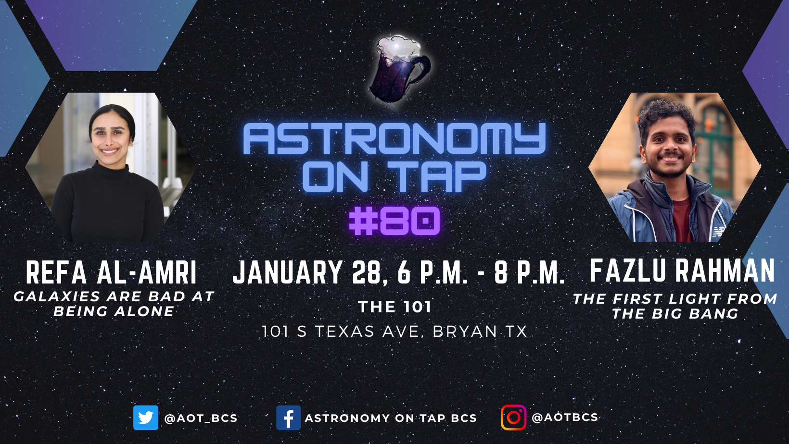

<figure>

</figure>

<table class="tg" style="undefined;table-layout: fixed; width: 100%"><colgroup>
<col style="width: 25%">
<col style="width: 75%">
</colgroup>
<tbody>
  <tr>
    <td class="tg-9l91">Summary:</td>
    <td class="tg-60hs"> Space looks lonely, but in reality this lonliness is an illusion. In this talk we explore how galaxies are born in cosmic neighborhoods, pulled together by gravity, and shaped by inevitable encounters. We explore how galaxies live, evolve, and sort of “die” together.  </td>
  </tr>
  <tr>
    <td class="tg-9l91">Date </td>
    <td class="tg-60hs">January 28, 2026.</td>
  </tr>
  <tr>
    <td class="tg-9l91">Event</td>
    <td class="tg-60hs">Astronomy on Tap BCS.</td>
  </tr>
  <tr>
    <td class="tg-9l91">Location</td>
    <td class="tg-60hs">The 101,  101 S TEXAS AVE,  BRYAN TX.</td>
  </tr>
</tbody></table>