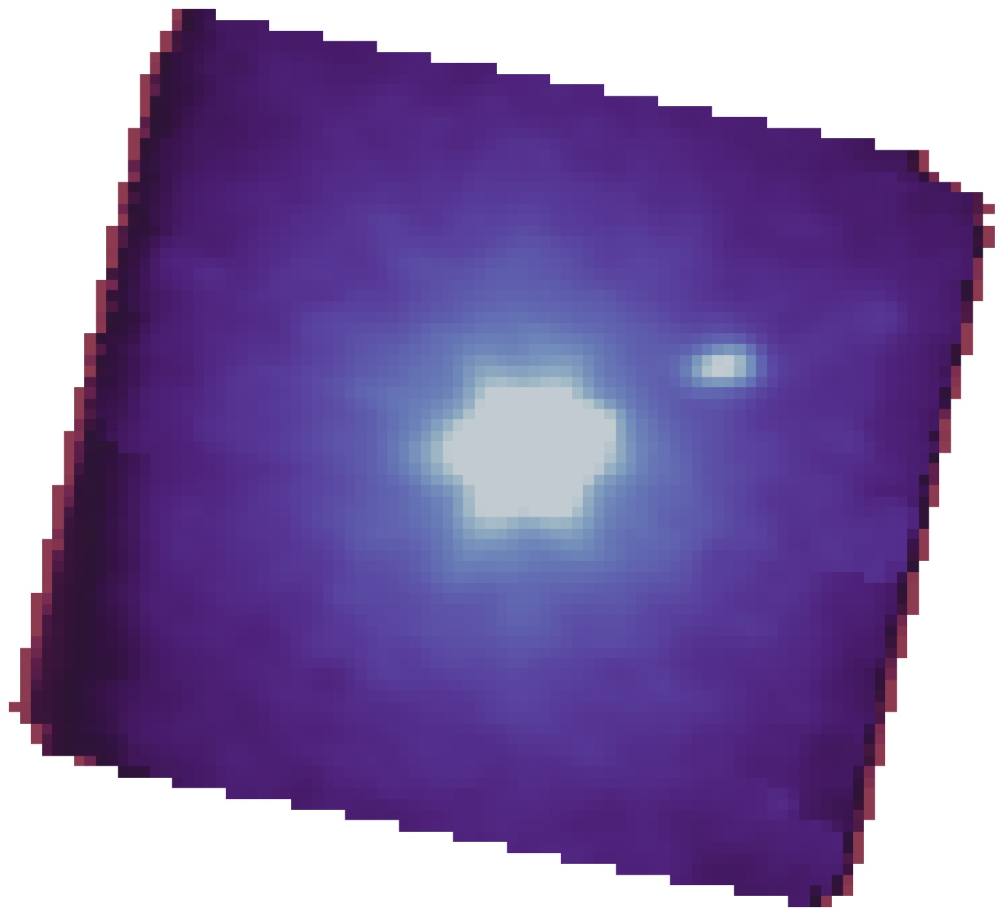

<html>
<head>
  

</head>
<body>
<main>
 

#### Summary
I am currently investigating the stellar and gas kinematics at the center of M87, one of the most massive elliptical galaxies in the nearby universe. Using the extraordinary spatial and spectral resolution of the JWST’s NIRSpec Integral Field Unit (IFU), I aim to map the detailed motion of stars and gas in the core of this galaxy. This project will provide valuable insights into the dynamics of one of the most studied galaxy cores, shedding light on the role of black holes in shaping the central regions of galaxies and the broader processes that govern galaxy formation.

<figure style="display: block; margin-left: 100px; margin-right: 100px; text-align: center">
 
<figcaption>Figure 1 : Collapsed data cube showing the center of M87 observed with JWST/NIRSpec IFU</figcaption>
</figure>
</main>
</body>

<html>
